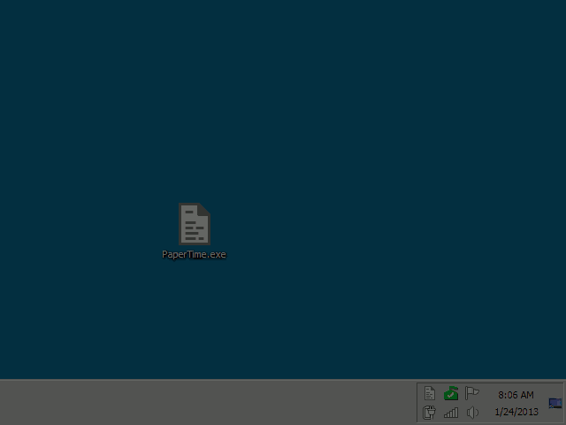

Paper Time
==========

Paper Time is a simple MarkDown inspired syntax to track time using text files and a tool to convert those files into beautiful reports. It uses Notepad.exe as its editor because of the [.LOG feature](https://support.microsoft.com/en-us/kb/260563) and F5 hot-key (insert a time stamp).

It's a simple and flexible solution – the file format is human readable and you could basically use any kind of editor (or even a sheet of paper) to track time.

Syntax
------

The parser is looking for lines that starts with a time stamp. The time stamp must be followed by a category that can be split up using slashes (e.g. `1:33 PM 8/12/2015	Company/Project`). The next line that starts with a time stamp is the end time of that entry and can be the start time of the next entry (if a category was provided). Time that should not be tracked must be marked by a line that contains at least three dashes (e.g. `---`).

### Example

    1:33 PM 8/12/2015	CompanyA/ProjectA
    
    - some comments
    
    2:45 PM 8/12/2015	CompanyA/ProjectB
    
    3:51 PM 8/12/2015
    -----------------
    8:03 AM 8/13/2015	CompanyB/ProjectC
    
    - more comments
    
    10:44 AM 8/13/2015
    ------------------

Reports
-------

Open your text file with the PaperTime.exe to generate a report. The file will also be launched using Notepad.exe for you to make further changes.